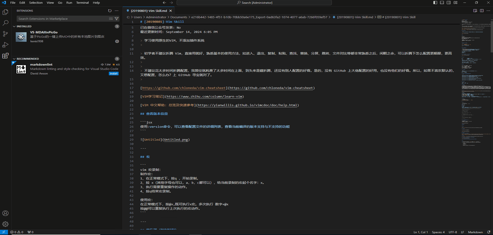

# VS-MDAllInPicGo

VS-MDAllInPicGo 是一个 Visual Studio Code 扩展，它可以帮助你快速上传 Markdown 文件中的本地图片到图床，并自动替换图片链接。

## 使用方法

1. 配置 PicGo

   首先，你需要配置你的图床信息。在命令行中运行以下命令：

   ```bash
   npx picgo set uploader
   ```

   按照提示选择你想使用的图床并填写相关信息。这将自动生成 PicGo 的配置文件。

   PicGo 的默认配置文件路径：
   - Windows: `C:\Users\[你的用户名]\.picgo\config.json`
   - Linux: `~/.picgo/config.json`
   - macOS: `~/.picgo/config.json`

   你可以直接编辑这个文件来修改配置，或者使用 `npx picgo set` 命令来更改设置。

2. 安装 VS-MDAllInPicGo 扩展

   在 VS Code 的扩展市场中搜索 "VS-MDAllInPicGo" 并安装。

3. 使用扩展

   - 打开一个 Markdown 文件
   - 右键点击编辑器，在上下文菜单中选择 "上传并替换 Markdown 中的本地图片到图床"
   - 扩展将自动上传文件中的所有本地图片，并替换为图床链接

4. Demo


## 注意事项

- 确保你的 PicGo 配置文件正确设置，否则上传可能会失败
- 上传大量图片可能需要一些时间，请耐心等待
- 如果上传过程中出现错误，请查看输出面板中的详细信息
- 如果你需要更改图床设置，可以直接编辑 PicGo 的配置文件

## 问题反馈

如果你在使用过程中遇到任何问题，或者有任何建议，欢迎在 GitHub 仓库中提出 issue。

## 许可证

本项目采用 MIT 许可证。详情请见 [LICENSE](LICENSE) 文件.
